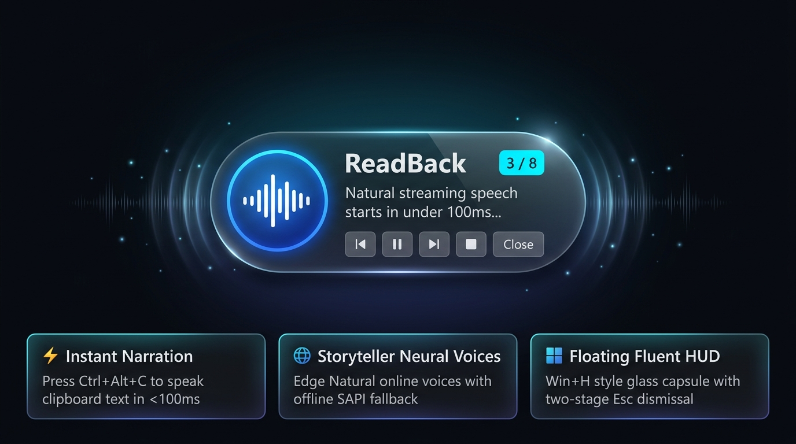

# ReadBack 🎙️

<p align="center">
  
</p>

> **Instant Screen & Document Text-to-Speech for Windows**  
> Built with modern **C# & .NET 10**, Microsoft Edge Neural Voices, offline Windows SAPI fallback, and a sleek **Win+H style floating HUD**.

---

## 🌟 What is ReadBack?

ReadBack turns any text on your screen into natural, human-sounding speech instantly. While reading from the Windows clipboard (`Ctrl+Alt+C`) is the primary out-of-the-box modality, ReadBack's core engine is built around a pluggable text source architecture (`ITextSource`) designed for universal screen reading—including active selections, paragraph click-to-read actions, web pages, and Word/PDF documents.

Highlight any text, press **`Ctrl + Alt + C`**, and listen.

> 📖 **Looking for full documentation?** Check out the [ReadBack User & Customization Guide](docs/USER_GUIDE.md).

---

## ✨ Key Features

- ⚡ **Instant Streaming Playback**: Chunks text by sentence and paragraph. Audio playback starts within milliseconds while upcoming chunks synthesize seamlessly in the background.
- 🪟 **Windows 11 Floating Glass HUD (`Win+H` Style)**:
  - Default **Windows 11 Acrylic Glass** aesthetic with native DWM blur, subtle specular border, and ambient drop shadow.
  - **Modular Theming Engine**: Switch instantly between *Windows 11 Glass*, *Windows 11 Mica (Dark)*, *Windows 11 Light Glass*, and *High Contrast Accessibility*.
  - Live progress display (`2 / 5`), current sentence preview, animated 3-bar soundwave visualizer, and drag grip.
  - **Persistent on Completion**: Stays on screen when reading finishes so you never lose your place.
  - Mini media controls: **Previous Paragraph**, **Play/Pause**, **Next Paragraph**, **Stop**, and **Close**.
- 🗣️ **Categorized Voice Selection**:
  - **🌐 Neural Voice Selection**: Ultra-realistic Microsoft Edge natural online voices filtered cleanly to English (Christopher ⭐, Guy ⚡, Jenny ⚡, Aria, Eric, Emma, Sonia, Ryan) with custom whitelist support in `settings.json`.
  - **🖥️ SAPI Voice Selection**: Fast local Windows offline voices (Microsoft David Desktop ⚡ for turbo speed and clarity, Microsoft Zira Desktop).
  - Zero API keys, subscriptions, or credit cards required.
- 📥 **Integrated Windows Voice Downloader**:
  - Direct shortcut from the tray menu into Windows Speech Settings (`ms-settings:speech`) to download dozens of free offline Microsoft voice packages.
- 🛡️ **Offline SAPI Fallback**: If offline or internet drops, automatically and gracefully falls back to local Windows voices (`David`, `Zira`). Dedicated *Offline Only (Windows SAPI)* toggle available in tray.
- 🧠 **Extensible Modular Architecture**:
  - Register custom TTS engines (`ITTSEngine`), custom HUD themes (`IHudTheme`), or narration cleanup filters (`INarrationFilter`) with clean single-interface contracts.
- ⌨️ **Native Global Hotkeys & Two-Stage Escape**:
  - `Ctrl + Alt + C`: Narrate clipboard (or toggle).
  - `Ctrl + Alt + H`: Toggle / show Heads-Up Display (HUD).
  - `Ctrl + Alt + Space`: Pause / Resume.
  - `Ctrl + Alt + Right`: Skip to next paragraph.
  - `Ctrl + Alt + Left`: Jump to previous paragraph.
  - `Ctrl + Alt + X`: Immediately stop narration.
  - `Esc`: **Two-Stage Dismissal** — first press stops narration while keeping HUD open; second press dismisses the HUD.
- 🔔 **System Tray Integration**:
  - **Left-Click**: Instantly shows and focuses the floating HUD.
  - **Right-Click**: Opens the full categorized context menu for Neural voices, SAPI voices, speeds (0.85x up to 3.0x Turbo), themes, and settings.
- 🚀 **Zero Script Wrappers & Instant IPC**: Pure compiled Windows binary (`ReadBack.exe`). Background NamedPipe IPC allows instant CLI signaling (`--clip`, `--turbo`, `--hud`, `--stop`) in 0ms without hijacking the console.

---

## ⌨️ Global Shortcuts

| Shortcut | Action | Description |
| :--- | :--- | :--- |
| **`Ctrl + Alt + C`** | Narrate Clipboard | Reads current clipboard text (or toggles stop/start) |
| **`Ctrl + Alt + H`** | Toggle HUD | Shows or hides the floating Windows 11 capsule toolbar |
| **`Ctrl + Alt + Space`** | Pause / Resume | Pauses speech at the exact current position |
| **`Ctrl + Alt + Right`** | Next Paragraph | Skips forward to the next sentence or paragraph |
| **`Ctrl + Alt + Left`** | Previous Paragraph | Jumps back to repeat previous sentence or paragraph |
| **`Ctrl + Alt + X`** | Stop Narration | Immediately stops active speech |
| **`Esc`** | Two-Stage Dismiss | **1st press**: Stops playback (keeps HUD open)<br/>**2nd press**: Dismisses the HUD |

---

## 💻 Command Line & Script Helpers

ReadBack supports background NamedPipe IPC. When `ReadBack.exe` is already running in your tray, running CLI commands signals the active instance in milliseconds without launching a second app or stealing terminal focus:

```powershell
# 1. Narrate clipboard text:
.\publish\ReadBack.exe --clip

# 2. Narrate clipboard in high-speed Turbo mode (2.0x):
.\publish\ReadBack.exe --clip --turbo

# 3. Toggle or show the floating Heads-Up Display:
.\publish\ReadBack.exe --hud

# 4. Stop or pause current playback:
.\publish\ReadBack.exe --stop
.\publish\ReadBack.exe --pause

# 5. Speak custom text directly:
.\publish\ReadBack.exe --text "Hello from ReadBack!"

# 6. List all available natural and offline voices in the terminal:
.\publish\ReadBack.exe voices
```

---

## 🛠️ Building & Running (.NET 10)

### Prerequisites
- Windows 10 or 11 (64-bit)
- [.NET 10 SDK](https://dotnet.microsoft.com/download/dotnet/10.0)

### 1. Build & Run from Source
```powershell
# Build entire solution
dotnet build ReadBack.slnx -c Release

# Run ReadBack application
dotnet run --project src/ReadBack.App/ReadBack.App.csproj
```

### 2. Run Tests
```powershell
dotnet test ReadBack.slnx
```

### 3. Publish Single-File Executable
```powershell
dotnet publish src/ReadBack.App/ReadBack.App.csproj -c Release -r win-x64 -p:PublishSingleFile=true -o publish/
```
The published folder will contain a standalone `ReadBack.exe` ready to be copied anywhere or placed in your Windows Startup folder (`shell:startup`).

---

## 📂 Project Structure

```
readback/
├── ReadBack.slnx                  # .NET 10 Solution
├── ROADMAP.md                     # Extensibility blueprint & future wishlist
├── README.md                      # Documentation & user guide
├── src/
│   ├── ReadBack.Core/             # Pure Domain & Business Logic
│   │   ├── Models/                # SpeechChunk, PlaybackState, AppSettings, VoiceInfo
│   │   ├── Filters/               # Extensible narration pipeline & regex filters
│   │   ├── Chunking/              # Sentence & paragraph chunker
│   │   ├── TTS/                   # Edge Neural WebSocket client & SAPI fallback
│   │   └── Services/              # Playback controller & settings management
│   └── ReadBack.App/              # Modern WPF Windows Application
│       ├── Services/              # Native Win32 Hotkeys, Clipboard, Audio, Tray
│       ├── ViewModels/            # HudViewModel & RelayCommand
│       ├── Views/                 # MiniFloatingHud (Win+H style capsule)
│       └── Assets/                # icon.ico
└── tests/
    └── ReadBack.Tests/            # Unit tests for filters, chunking, and extensibility
```

---

## 📄 License
This project is licensed under the **Apache License 2.0**. See the [LICENSE](LICENSE) and [NOTICE](NOTICE) files for details.
